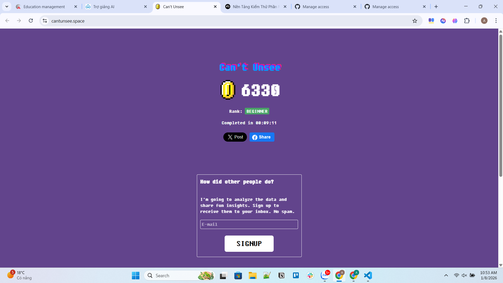

# software-testing

# can't unsee



---

## Chủ đề: Phân tích dữ liệu điểm số học sinh

### Mô tả chức năng

Chương trình Java này bao gồm lớp `StudentAnalyzer` với các phương thức sau:

1.  `countExcellentStudents(List<Double> scores)`:
    - Phân tích điểm số và trả về số lượng học sinh đạt loại Giỏi (điểm >= 8.0).
    - Bỏ qua các điểm không hợp lệ (nhỏ hơn 0 hoặc lớn hơn 10).
    - Trả về 0 nếu danh sách điểm rỗng.

2.  `calculateValidAverage(List<Double> scores)`:
    - Tính điểm trung bình của các điểm hợp lệ (từ 0 đến 10).
    - Bỏ qua các điểm không hợp lệ (nhỏ hơn 0 hoặc lớn hơn 10).
    - Trả về 0 nếu danh sách rỗng hoặc không có điểm hợp lệ nào.

### Yêu cầu kỹ thuật

- **Điều kiện 1:** Nếu điểm nhỏ hơn 0 hoặc lớn hơn 10 thì bỏ qua.
- **Điều kiện 2:** Nếu danh sách rỗng thì trả về kết quả mặc định (0 cho số lượng, 0.0 cho điểm trung bình).

### Hướng dẫn chạy kiểm thử đơn vị

Dự án này sử dụng Maven và JUnit 5. Để chạy các bài kiểm thử đơn vị, bạn có thể sử dụng lệnh sau trong thư mục gốc của dự án:

**Trên Linux/macOS:**

```bash
./mvnw test
```

**Trên Windows:**

```bash
mvnw.cmd test
```
